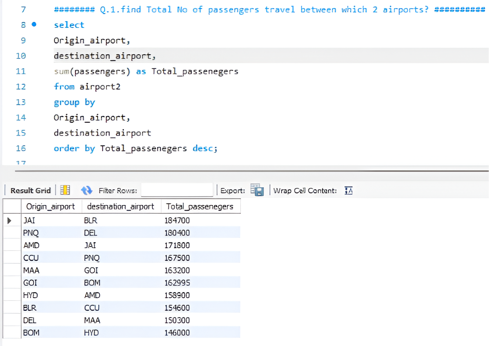
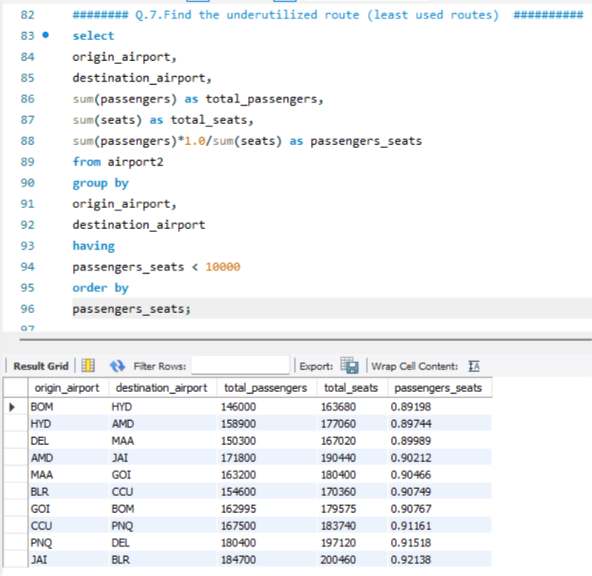
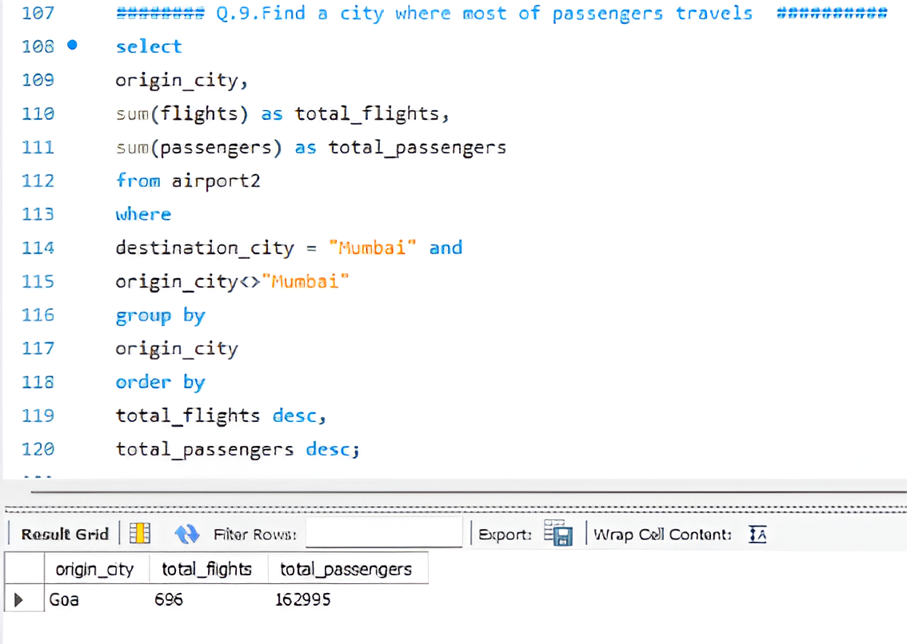
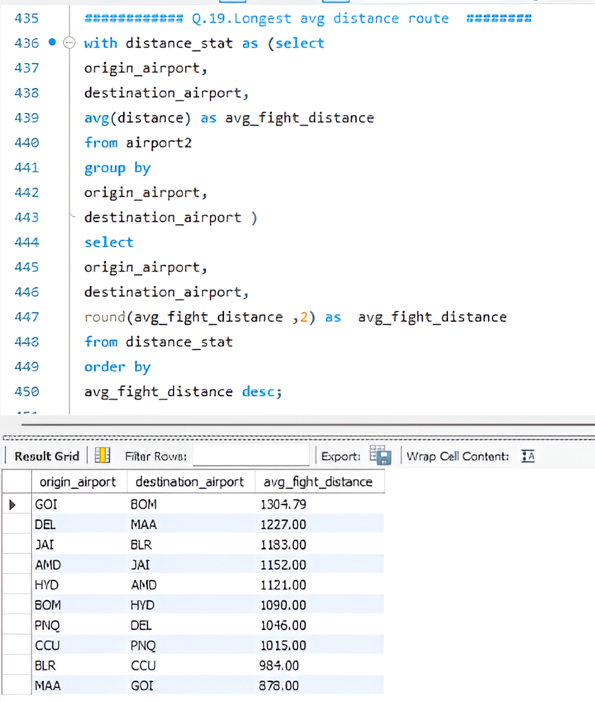

# ✈️ Airline Operations & Passenger Analysis Using MySQL

## 📌 Project Overview

This project analyzes airline operational and passenger data using **MySQL** to identify useful insights related to flight routes, passenger demand, seat utilization, airport activity, seasonal travel patterns, route performance, and flight distance.

The project contains **19 SQL business problems**, ranging from basic aggregation and filtering to advanced analysis using **CTEs and Window Functions**.

The goal is to demonstrate how SQL can be used to solve practical problems in **airline operations and passenger analytics**.

---

## 🎯 Business Objectives

The analysis focuses on questions such as:

* Which airport pairs have the highest passenger traffic?
* Which routes have high or low seat utilization?
* What are the most frequently traveled routes?
* Which airports have the highest flight activity?
* Which cities have the highest passenger traffic?
* What are the seasonal travel patterns?
* How is passenger demand changing year over year?
* Which routes are trending or declining?
* Which routes are underperforming?
* Which routes have the longest average flight distance?

---

## 🛠️ Tools & Technologies

* **MySQL**
* **SQL**
* **Excel**
* MySQL Workbench

### SQL Concepts Used

* SELECT
* WHERE
* GROUP BY
* HAVING
* ORDER BY
* Aggregate Functions
* CASE Statements
* CTEs
* Window Functions
* `LAG()`
* Date Functions
* Self Join
* Percentage Calculations
* `NULLIF()`

---

## 📊 Dataset

The dataset contains airline flight information including:

| Column                | Description          |
| --------------------- | -------------------- |
| `fly_date`            | Date of the flight   |
| `origin_airport`      | Departure airport    |
| `destination_airport` | Arrival airport      |
| `origin_city`         | Departure city       |
| `destination_city`    | Arrival city         |
| `passengers`          | Number of passengers |
| `seats`               | Available seats      |
| `flights`             | Number of flights    |
| `distance`            | Flight distance      |

---

# 🔎 Key Analysis

## 1. Passenger Demand Between Airports

The first analysis identifies airport pairs with the highest total passenger traffic.

The result shows:

**JAI → BLR — 184,700 passengers**

followed by:

* PNQ → DEL — 180,400
* AMD → JAI — 171,800
* CCU → PNQ — 167,500
* MAA → GOI — 163,200

This analysis can help understand high-demand routes and support airline capacity planning.

---

## 2. Underutilized Routes

The project calculates the passenger-to-seat ratio for each origin-destination pair.

This helps identify routes where available seat capacity may not be fully utilized.

The analysis can support:

* Capacity management
* Route optimization
* Flight scheduling
* Operational efficiency

---

## 3. Passenger Traffic to Mumbai

A separate analysis identifies cities sending passengers to Mumbai while excluding Mumbai as the origin city.

The result shows:

**Goa → Mumbai**

with:

* **696 flights**
* **162,995 passengers**

This provides a city-level view of passenger movement toward Mumbai.

---

## 4. Longest Average Distance Routes

The project also analyzes average flight distance between airport pairs.

The highest average distance route in the analysis is:

**GOI → BOM — 1,304.79**

Other long-distance routes include:

* DEL → MAA — 1,227 km
* JAI → BLR — 1,183 km
* AMD → JAI — 1,152 km
* HYD → AMD — 1,121 km

This analysis can provide insights into long-haul travel patterns.

---

# 📈 Major Analysis Areas

### ✈️ Route Analysis

* Top passenger routes
* Frequent travel routes
* Underutilized routes
* Underperforming routes
* Declining routes
* Long-distance routes

### 👥 Passenger Analysis

* Passenger traffic between airports
* City-level passenger movement
* Passenger growth
* Year-over-year passenger analysis
* Peak passenger periods

### 💺 Capacity Analysis

* Passenger-to-seat ratio
* Seat utilization
* Airport utilization
* Capacity management

### 🏢 Airport Operations

* Active airports
* Flight frequency
* Airport passenger activity
* Origin-city performance

### 📅 Seasonal Analysis

* Monthly flight activity
* Monthly passenger activity
* Peak travel months
* Seasonal travel patterns

---

# 🧠 Advanced SQL Analysis

One of the important parts of this project is **Year-over-Year Passenger Growth**.

The analysis uses the `LAG()` Window Function to compare the current year's passengers with the previous year's passengers.

Example:

```sql
LAG(total_passengers) OVER (
    PARTITION BY origin_airport, destination_airport
    ORDER BY year
) AS previous_year_passenger
```

The previous year's passenger value is then used to calculate the growth percentage.

This demonstrates the use of SQL Window Functions for analytical problems.

---

## 📁 Project Structure

```text
airline-operations-passenger-analysis-mysql/
│
├── dataset/
│   └── airport2.xlsx
│
├── documentation/
│   └── airport-data-analysis.pdf
│
├── results/
│   ├── total-passengers-between-airports.png
│   ├── underutilized-routes.png
│   ├── city-passenger-analysis.png
│   └── longest-average-distance-route.png
│
├── sql/
│   └── airline_operations_analysis.sql
│
└── README.md

---

## 📸 SQL Analysis Results

### 1. Total Passengers Between Airports



### 2. Underutilized Routes



### 3. City Passenger Analysis



### 4. Longest Average Distance Route



# 💼 Business Applications

The insights from this project can help airline teams with:

* Route planning
* Flight scheduling
* Capacity planning
* Passenger demand analysis
* Airport resource planning
* Seasonal planning
* Operational efficiency
* Route performance monitoring

---

# 🚀 Learning Outcomes

Through this project, I developed practical experience in:

* Solving business problems using SQL
* Analyzing airline operational data
* Passenger demand analysis
* Route performance analysis
* Capacity and seat utilization analysis
* Seasonal trend analysis
* Year-over-year analysis
* CTE-based SQL analysis
* Window Functions
* Translating SQL results into business insights

---

# ⭐ Conclusion

This project demonstrates how **MySQL and SQL analytics** can be used to analyze airline operations and passenger behavior.

By combining route analysis, passenger demand, airport activity, capacity utilization, seasonal trends, growth analysis, and distance analysis, the project provides a practical example of **business-focused data analysis using SQL**.

---

## 🔖 Skills

`MySQL` `SQL` `Data Analysis` `Airline Analytics` `Passenger Analytics` `Operations Analytics` `Business Analytics` `CTE` `Window Functions` `LAG` `KPI Analysis`
